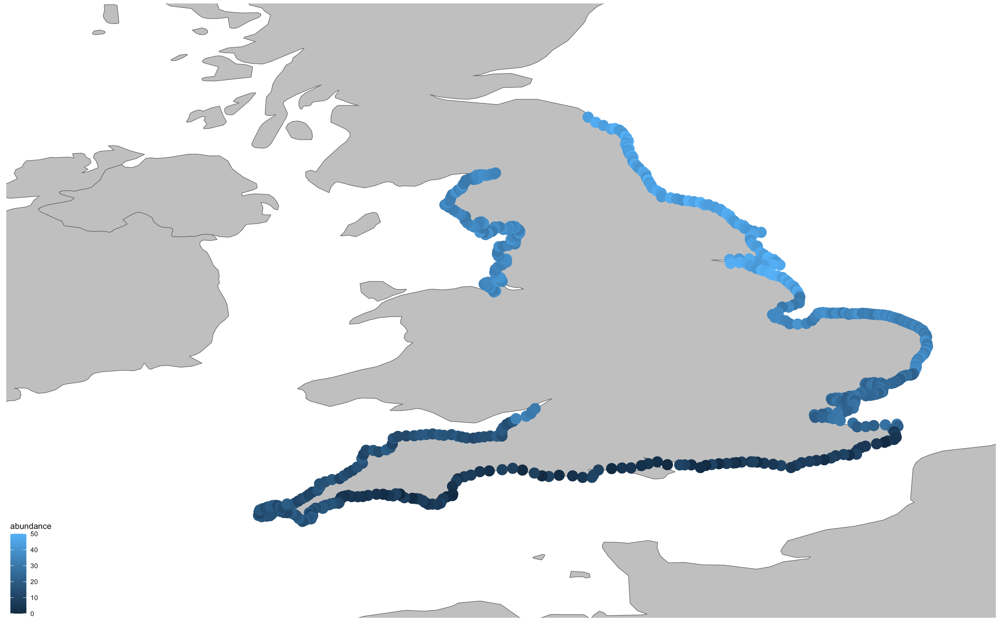

\-\-\-\-\-\-\-\-\-\-\-\-\-\-\-\-\-\-\-\-\-\-\-\-\-\-\-\-\-\-\-\-\-\-\-\-\-\-\-\-\-\-\-\-\-\-\-\-\-\-\-\-\-\-\-\-\-\-\-\-\-\-\-\-\-\-\-\-\-\-\-\-\-\-\-\-\-\-\-\-\-\-\-\-\-\-\-\-\-\-\-\-\-\-\-\-\-\-\-\-\-\-\-\-\-\-\-\-\-\-\-\-\-\-\-\-\-\-\-\-\-\-\-\-\-\-\-\-\-\-\-\-\-\-\-\-\-\-\-\-\-\-\-\-\-\-\-\-\-\-\-\-\-\-\-\-\-\-\-\-\-\-\-\-\--

Created by Tianqi Zhu

### Tutorial Aims

#### 1. Understand why maps are useful

#### 2. Creating maps for specific area

#### 3. Analysis a case with spacial data

### Steps

#### <a href="#section1"> 1. Why is map useful in visualizing data</a>

#### <a href="#section2"> 2. Use coordinate to find your place</a>

#### <a href="#section3"> 3. Case analysis by plotting maps</a>

#### <a href="#section4"> 4. How to compare 2 maps </a>

#### <a href="#section4"> 5. Conclusions </a>

#### <a href="#section5"> 6. Challenge yourselves </a>

#### <a href="#section5"> 7. Useful links </a>

You can get all of the resources for this tutorial from <a
href="https://github.com/EDTianqi/Mapping-spacial-data.git" target="_blank">this GitHub repository</a>. Click on Code/Download ZIP and unzip the folder, or clone the repository to your own GitHub account. <a name="section1"></a>

## 1.Why using maps for data visualizing?

In ecological and environmental researching, data can be classified into different types. In some cases, when you are trying to see the relationship of one variable to different spacial factors, mapping can best visualize it. Why is that? Check out the example below.


looking good and informative! But an important thing is missing. Did you get a good understanding about how the specie spreads by looking at this box plot? It is obvious to see that some certain site support higher abundance of the species, but where is it? Are two or more closer site all supports higher population? In order to achieve those purposes, a map is necessary.

<a name="section2"></a>

## 2. Using coordinate to find your place

How can R know where was our data collected? The answer is by including metadata which is coordinate. Coordinate is simply the longitude and latitude of a certain place. For example: Latitude\|55.94994906353063, longitude\|-3.1908803548347264 is a coordinate of Edinburgh, UK. The more digits there are, the more precise the location.

It is the same on creating maps by using R. Simply tell R from what range of longitude and latitude of the region that we want for our map, we can zoom in to the country, area, that we are interested in.

Now, let's try create a simple map.

Create a new R Script where contains the script of mapping for this tutorial. Always remember to set your working directory before next step by using the following code.

``` r
# Set the working directory
setwd("your_filepath")


```

Let's create a map and zoom in Australia. Click [here](https://ourcodingclub.github.io/tutorials/datavis/) to check previous data visualization tutorial. We need to use ggplot2 package.

```{r}

# Load packages
library(ggplot2)

(plot_map <- ggplot() +  
    # Add world map and choose color for it
    borders("world", colour = "gray40", fill = "gray75", size = 0.3)) 
```


**Remember to put entire ggplot code in brackets ().** If you don't put them in the brackets, you've only created the object, but haven't visualized it.

Nice job! See different numbers along the x and y axis? ] "long" represent longitude while "lat" represent latitude. As we can see from the map, Australia can be described as longitude (110, 160), latitude (-45, -5). Let's try adding this information to R.

```{r}
(plot_map <- ggplot() +  
    borders("world", colour = "gray40", fill = "gray75", size = 0.3)+ # Add world map and choose color for it
    coord_cartesian(xlim = c(110, 160), ylim = c(-45, -5))) # Australia's longitude and latitude
```


Great! Here it is! A map of Australia! Now this map is waiting for data to add on it.

<a name="section3"></a>

## 3. Case analysis by plotting map

Here we are going to focus on a fictional study about Dragons. In this case, dragons live around the coastal region in the England, UK. Our aim is to plot a map with the Dragon abundance data, to show the distribution of this creature. Moreover, to test whether the population increased over time or not. We sampled the abundance of dragon on different coastal site along England, UK for 7 years start from 2000.

### 3.1 Exploring the data

First, let's load the csv. file contains all the data.

```{r}
library(readr)

# load our data
dragondata <- read_csv("dragondata.csv")

head(dragons)
```

Have a quick look of the data set, get familiar with it.

### 3.2 Cleaning up the data

Let's clean up our data first. To do this, we need the tidyverse package. Click [here](https://ourcodingclub.github.io/tutorials/data-manip-intro/) for previous data manipulation. We want to make our data set to have one column for years and another column for abundance data.

```{r}
library(tidyverse)

# Cleaning up the data
dragon <- dragondata %>%
  pivot_longer(cols = 4:10, names_to = "year", values_to = "abundance", values_drop_na = TRUE)  %>%  
  # only keep numbers for year
  mutate(year = parse_number(year)) %>% 
  # only keep numbers for year
  rename(lat = Y, lon = X)   
```

First of all, lets' focus on dragon abundance in 2000. Let's filter them out.

```{r}
dragon_2000 <- dragon %>%
  filter(year == "2000")
```

Now, check your new data set dragon_2000. We are ready for plotting the map!

### 3.3 Creating the map

Let's create a map focused on England as what we have just been practiced.

```{r}
library(ggthemes)

(plot_map <- ggplot() +  
    # create a world map first
    borders("world", colour = "gray40", fill = "gray75", size = 0.3)+ 
    # Zoom in on England UK
    coord_cartesian(xlim = c(-8, 2), ylim = c(49, 57))+
    # Zoom in on England UK
    theme_map())  
```


### 3.3 Adding observed data on the map

How can R knows where should each abundance data to be allocated? Notice that we have metadata in our data set? Longitude and latitude. Remember, everything are related to coordinate when you plot a map.

```{r}
(plot_map <- ggplot() +  
    # create a world map first
    borders("world", colour = "gray40", fill = "gray75", size = 0.3)+ 
    # Zoom in on England UK
    coord_cartesian(xlim = c(-8, 2), ylim = c(49, 57))+
    # Clean up the graph
    theme_map()+ 
    # Add points of the abundance data, colored by value
    geom_point(data = dragon_2000, aes(x = lon, y = lat, color = abundance), size = 5))  
```



See how the data is distributed along the coastal line of England? Can you spot something according to the color gradient of the abundance data in 2000? The lighter the color, the more individuals found in a sample site. The population of dragon seems increases as it gets further away to the north.

### 3.4 Adding informative marks (cities) on the map

Adding important cities or land marks to the maps are usually important and informative. This provide extra information about the situation of a certain place within the country. Let's do it for two important coastal cities in England, Liverpool and Brighton. How can we let R know where are the cities? Again, using coordinate!

First, we need to create a vector, contains the cities that we want to show on the map. Then, adding the coordinate of those cities.

Create another vector for city color. Click [here](https://ourcodingclub.github.io/tutorials/datavis/) to check how to choose colors from color palette.

```{r}
cities <- data.frame(
 "Cities" = c( "Brighton", "Liverpool"),
  "lon" = c(-0.13, -2.99), 
  "lat" = c(50.82, 53.4)
) 

# choose 2 colors for each city
colours <- c("#56B4E9",  "#D55E00")
```

Now, we can add another set of data point to the map that shows the cities' location.

```{r}
(plot_map <- ggplot() + 
    # create a world map
    borders("world", colour = "gray40", fill = "gray75", size = 0.3)+ 
    # Zoom in on England, UK
    coord_cartesian(xlim = c(-8, 2), ylim = c(49, 57))+ 
    # Clean up the graph 
    theme_map()+   
    # Add points of the abundance data, colored by value
    geom_point(data = dragon_2000, aes(x = lon, y = lat, color = abundance), size = 5)+  
    #Add city location, colored by the color we chose
    geom_point(data = cities, aes(x = lon, y = lat), size = 6, fill = colours[c(2,1)], colour = "black", shape = 23)+
    # Add city names
    geom_text(data = cities, aes(x = lon, y = lat, label = Cities), size = 8, hjust = 0, vjust = -1) ) 

```


Here we go! We have Brighton and Liverpool on the map now. What extra information about dragon abundance in each city can you get?

According to the color gradient, the lighter the greater abidance, Liverpool has more dragons than Brighton.

Now, let's finish the final part of the map, adjust legend position and create a title for the map.

```{r}
(plot_map <- ggplot() + 
    # Add world map
    borders("world", colour = "gray40", fill = "gray75", size = 0.3)+ 
    # Zoom in on England, UK
    coord_cartesian(xlim = c(-8, 2), ylim = c(49, 57))+ 
     # Clean up the graph 
    theme_map()+  
    # Add points of the abundance data, colored by value
    geom_point(data = dragon_2000, aes(x = lon, y = lat, color = abundance), size = 5)+  
      #Add city location, colored by the color we chose
    geom_point(data = cities, aes(x = lon, y = lat), size = 6, fill = colours[c(2,1)], 
    colour = "black", shape = 23)+
    # Add city names
    geom_text(data = cities, aes(x = lon, y = lat, label = Cities), color= "black",size = 8,       hjust = 0, vjust = -1)+ 
    # adjusting legend position
    theme(legend.position = "right", plot.title = element_text(size = 10, hjust = 0.5), 
    plot.background = element_rect(fill = "white")) + 
    # Give the graph/map a title
    labs(title = "Dragon abundance observed in 2000"))  

```


```{r}
ggsave(
  # Give the graph a file name and location
  filename = "dragon abundance in England, UK in 2000/plot_map.png",   
  # Indicate which plot you would like to save
  plot = plot_map,  
  # Indicate the file type
  device = "png",  
  # Indicate the height of the graph
  height = 15,  
   # Indicate the width of the graph
  width = 13, 
   # Indicate in which unit the height and the width were given
  unit = "cm" 
)
```

Always remember to save your plots

<a name="section4"></a>

## 4. How to compare two plots?

Well done! That's a informative map. We now can generally look at what was happened in 2000. According to the map, we can see that the abundance of dragon decrease as it gets further to the south. Liverpool has a higher dragon abundance than Brighton. The overall dragon abundance looks quite good!

Now, we have our second question. Does the abundance of the dragons stay on the same level compared to the later years? Dose the abundance of dragon decreased or increased?

Since 2000 is the first year of collecting data, we can also plot the data sampled in the last year of sampling and compare those two maps.

Now let's plot a map of the dragon abundance in 2006 and compare those two graphs, to see if there is any difference between them.

```{r}
dragon_2006 <- dragon %>%
  filter(year == "2006")

(plot_map2 <- ggplot() +  
    # Add world map first
    borders("world", colour = "gray40", fill = "gray75", size = 0.3)+
    # Zoom in on England, UK
    coord_cartesian(xlim = c(-8, 2), ylim = c(49, 57))+ 
    # Clean up the graph 
    theme_map()+   
    # Add points of the dragon abundance data, colored by value
    geom_point(data = dragon_2006, aes(x = lon, y = lat, color = abundance), size = 5)+ 
    #Add city position to the map
    geom_point(data = cities, aes(x = lon, y = lat), size = 6, fill = colours[c(2,1)], colour = "black", shape = 23)+
    # Add city names
    geom_text(data = cities, aes(x = lon, y = lat, label = Cities), color= "black",size = 8, hjust = 0, vjust = -1)+ 
    #adjust the legend position
    theme(legend.position = "right", plot.title = element_text(size = 10, hjust = 0.5), plot.background = element_rect(fill = "white")) + 
    # Give the graph/map a title
    labs(title = "Dragon abundance observed in 2006"))  
```


Now we have another map of dragon abundance in 2006!

```{r}
ggsave(
  # Give the graph a file name and location
  filename = "dragon abundance in England, UK in 2006/plot_map.png", 
   # Indicate which plot you would like to save
  plot = plot_map2, 
  # Indicate the file type
  device = "png",  
  # Indicate the height of the graph
  height = 15,  
   # Indicate the width of the graph
  width = 13, 
  # Indicate in which unit the height and the width were given
  unit = "cm"  
)
```

don't forget to save your plot!

How can we compare to things the most obvious? You might say just put them together. That's something R can so as well! Compare two plots by putting them together into one plot.

To do it, we will need to use gridExtra package

```{r}
library(gridExtra)
# combine two graphs together
combined <- grid.arrange(plot_map, plot_map2, ncol = 1)
```


What can you observe here? It seems like the abundance of dragon sampled in 2006 is less than the dragon abundance sampled in 2000 according to the color gradient. In addition to that, notice the maximum legend scale of 2006 map has decreased to 25. The maximum scale of dragon abundance of 2000 map is 50. Then we spot a great decrease of the dragon abundance over these 7 years.

<a name="section5"></a>


## 5. Conclusion
Well done for going through the tutorial! In this tutorial, you have learned:

1. Why are maps informative and important?
2. How to create a map of any region on the earth
3. How to add data points to your map and make it informative.
4. How to customize your maps.
5. How to compare multiple plots.


<a name="section6"></a>

## 6. Challenge yourselves
 To practice mapping spacial data by using R, Go back to the dragondata.scv, now can you
 1. Create a map of the United States?
 2. Create 2 maps which indicates the dragon abundance in 2001 and 2002?
 3. Create a line graph of the dragon abundance data of all years together?


<a name="section7"></a>

## 7. Useful information
1. for previous data visualization (making plots) https://ourcodingclub.github.io/tutorials/datavis/
2. for previous data visualization (making plots) https://ourcodingclub.github.io/tutorials/data-vis-2/
3. For previous data manipulation (data wrangling) https://ourcodingclub.github.io/tutorials/data-manip-intro/
4. For previous data manipulation (data wrangling) https://ourcodingclub.github.io/tutorials/data-manip-efficient/
5. For previous data manipulation (data wrangling) https://ourcodingclub.github.io/tutorials/data-manip-creative-dplyr/
6. For future mapping spacial data skills https://ourcodingclub.github.io/tutorials/maps/


